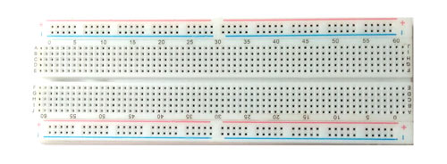
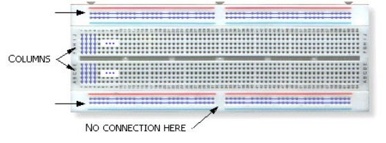
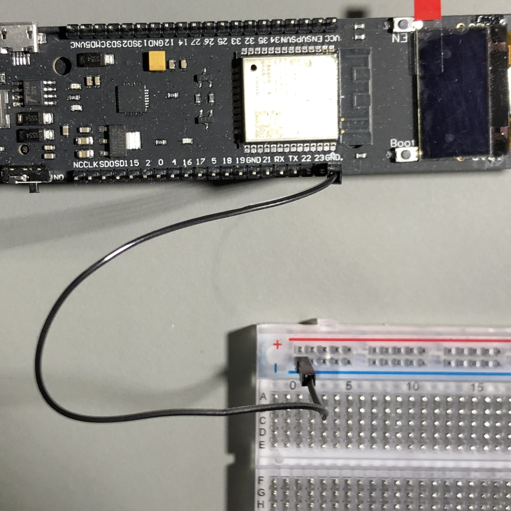
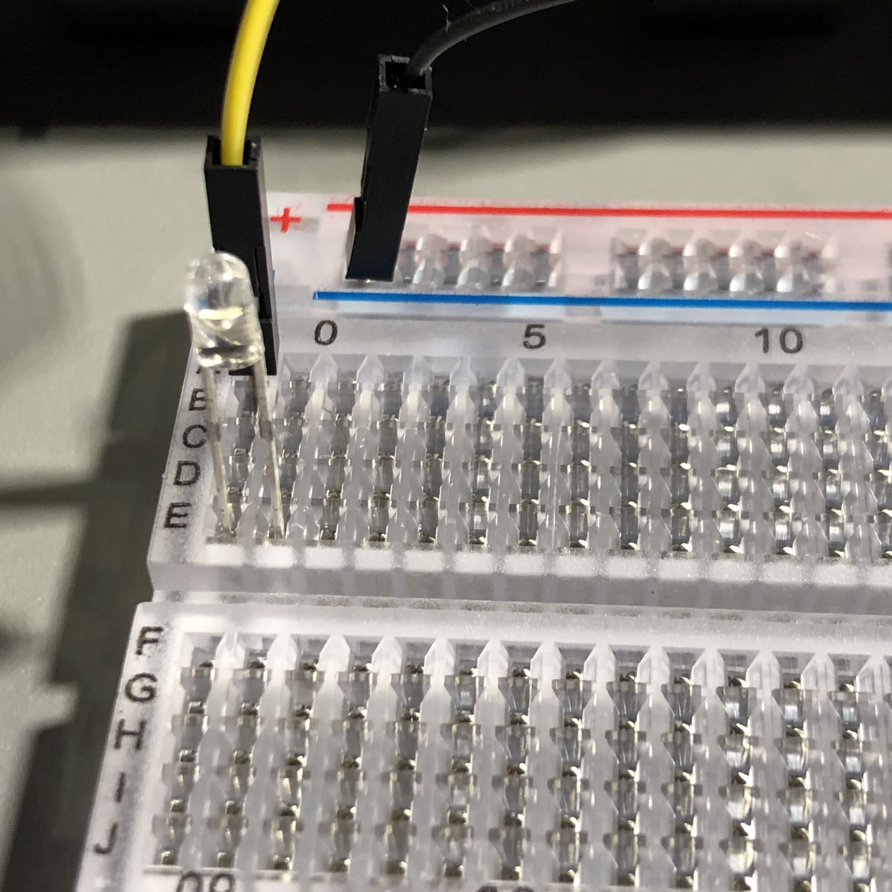
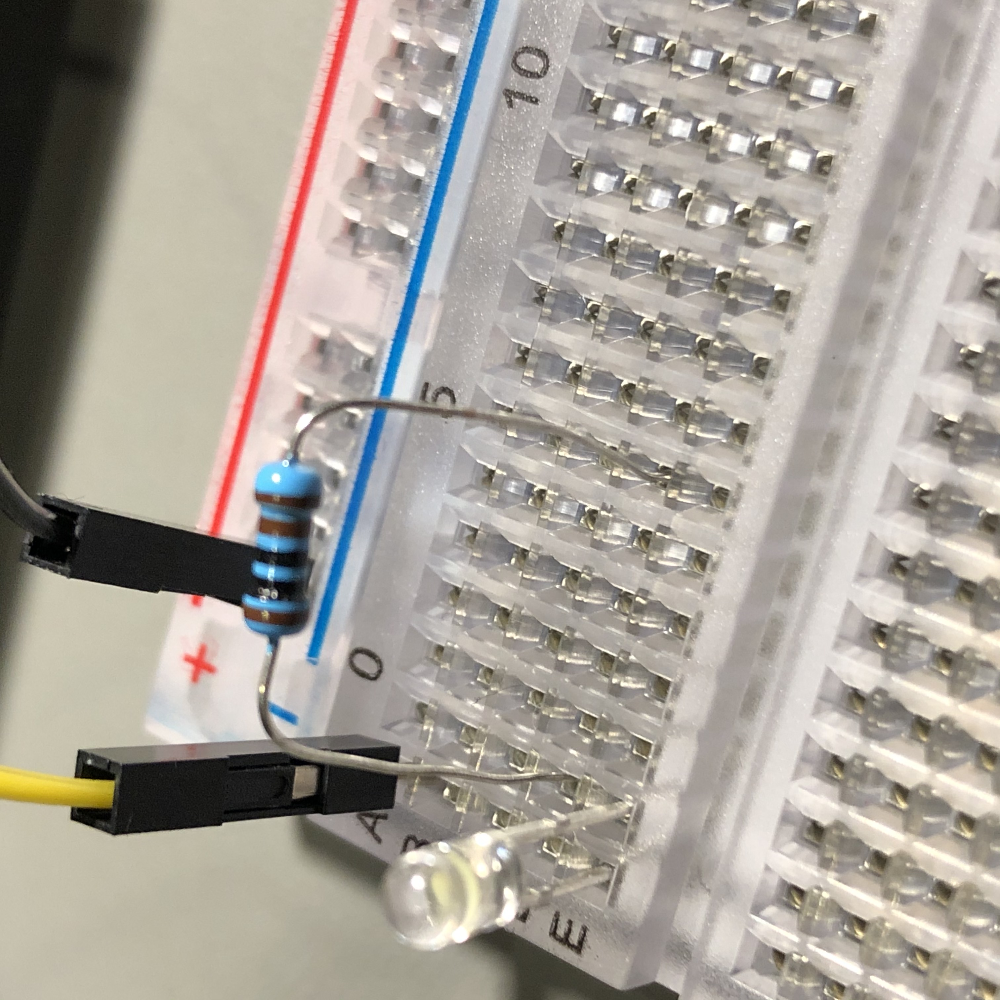
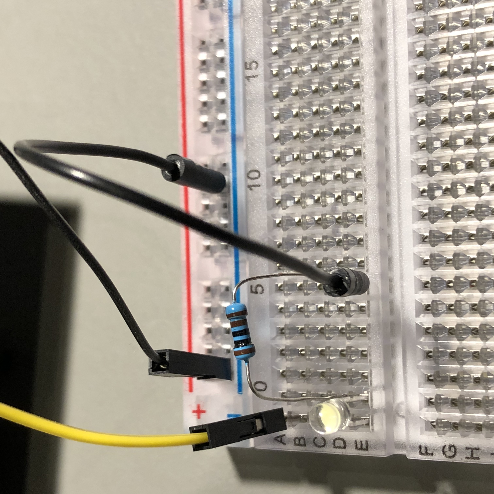
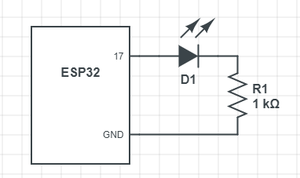

# Elektronikpyssel med Arduino
## Innehåll
* Arduinomodul ESP32 Wroom med SSD1306 OLED 128x64 på i2c

## Förberedelser
1. Ladda ner och installera Arduino Software från https://www.arduino.cc/en/Main/Software “Windows Installer”.
2. Starta Arduino IDE och gå in i File > Preferences. Skriv in https://dl.espressif.com/dl/package_esp32_index.json i “Additional Board Manager URLs”.
3. Gå till Tools > Board > Boards Manager… Sök på esp32 och installera esp32 by Espressif Systems.
4. Välj Tools > Board > ESP32 Arduino > ESP32 Dev Module.
5. Koppla in modulen till datorn med USB och slå switchen till "ON".
6. Välj Tools > Board > Port och välj den COM-porten som finns. Modulen har en USB-serial interface vars driver installeras med Arduino SDK.
7. Öppna Serial Monitor (Tools > Serial Monitor) och ställ in den på 115200 baud.
8. Tryck på EN på modulen, nu ska text från modulen visas i monitorn.
9. Skriv in följande i sketchen och spara:
```
void setup() {
  Serial.begin(115200);
  Serial.println("Hej från Arduino!");
}

void loop() {
}
```
10. Tryck på pilknappen på menyraden (Upload). Nu ska det stå "Hej från Arduino!" i serial monitorn.
11. Grattis, nu är allting klart för att köra.

## Displayen
Displayen är monokrom (svart-vit) och har 128x64 punkter. För att använda den gör man följande:
1. Gå till Tools > Library Manager, sök efter "ESP32 OLED Driver".
2. Installera "ESP8266 and ESP32 OLED driver for SSD1306 displays" från ThingPulse.
3. Skriv in följande i sketchen och spara:
```
#include "SSD1306Wire.h"

SSD1306Wire display(0x3c, 5, 4);

void setup() {
  Serial.begin(115200);
  display.init();
  Serial.println("Hej från Display!");
}

void loop() {
  display.clear();
  display.drawString(0, 0, "Hallå display!");
  display.drawString(0, 10, "Här är jag!");
  display.display();
  delay(100);
}
```
4. Tryck på pilknappen på menyraden (Upload).
5. Nu ska text komma upp på displayen!

## Kopplingsbord
Kallas också för breadboard. På breadborden kan man koppla ihop komponenter med varandra och till modulen med hjälp av sladdar. För att underlätta är breadboarden ihopkopplad inuti också.

|  |
| :--: |
| *Breadboard* |

På breadboardens ovansida och undersida finns en röd (+) och en blå (-) linje som visar hur de sitter ihop. Sedan är för varje siffra i en kolumn alla fem punkter A-E och F-J ihopkopplade var för sig.

|  |
| :--: |
| *Kopplingar inuti* |

Det är på breadboardet vi kopplar ihop våra experiment.

## 1. Lysdioden
En lysdiod är en komponent som släpper igenom ström åt ett håll och då lyser den. Det längre av de två benen är positiv (+) och det korta är negativ (-). I det här experimentet ska vi koppla in en lysdiod till en av modulens datapinnar och blinka med den. För att det inte ska komma för mycket ström genom dioden och riskera att skada modulen eller lysdioden ska vi också ha ett motstånd.

### Datapinnar
Modulen har en massa datapinnar som är numrerade. De kan ställas in från programmet att antingen vara digitala (av eller på) eller analoga (de kan ge ifrån sig eller läsa av olika spänningsnivåer). De kan också ställas in att vara i ut-läge (de ger ifrån sig spänning) eller in-läge (de detekterar spänning som kommer in). I det här läget ska vi göra en pinne digital och i ut-läge för att styra lysdioden.

### Koppling
1. Koppla en svart sladd från GND på modulen (GND är förkortning för ground vilket betyder jord. Det är vad man kallar den negativa (-) polen.) till ett hål på den blåa linjen på breadboarden.


2. Koppla en annan sladd (i exemplet gul) från pin 17 på modulen till en plats i kolumn 0 på breadboarden. Pin 17 ska vi använda som utpinne för att styra lysdioden.


3. Sätt i en lysdiod med det långa benet i kolumn 0 och det korta i kolumn 1. Nu är lysdiodens pluspol ihopkopplad med pin 16 på modulen med hjälp av breadboarden och den gula sladden.


4. Sätt ett motstånd på 1000 ohm mellan kolumn 1 (samma som lysdiodens minuspol) och kolumn 6.


5. Koppla en svart sladd från kolumn 6 (motståndets andra ben) till den blåa linjen där uppe. Nu är kretsen kopplad och när modulen lägger spänning på pin 17 kommer ström flyta genom den gula sladden, genom lysdioden, genom motståndet och till slut genom de två svarta sladdarna till modulens minuspol.


### Programmet
Skriv in detta i en ny sketch i Arduino:
```
void setup() {
  pinMode(17, OUTPUT);
}

void loop() {
  digitalWrite(17, HIGH);
  delay(1000);
  digitalWrite(17, LOW);
  delay(1000);
}
```
Tryck på pilknappen på menyraden (Upload). Nu ska lysdioden blinka.

### Beskrivning av programmet
Här är en genomgång av programmets beståndsdelar:
#### 1. Setup
Det som står inom `setup() { ... }` körs en gång när programmet startar. Här gör man inställningarna som behövs i början, i det här fallet att säga att pin 17 är en ut-pinne.
`{}`kallas för måsvingar eller krullparanteser. Man skriver `{` genom att trycka AltGr-7 på tangentbordet och `}` med AltGr-0.
```
void setup() {
  pinMode(17, OUTPUT);
}
```

`pinMode()` ställer in en pinne att vara ut eller in. I det här programmet sätter vi pin 17 till ut-pinne (OUTPUT).

#### 2. Loop
```
void loop() {
  digitalWrite(17, HIGH);
  delay(1000);
  digitalWrite(17, LOW);
  delay(1000);
}
```
Det som står inom `loop() { ... }` körs om och om igen tills man stänger av modulen eller startar om.

`digitalWrite(17, HIGH);` sätter en digital ut-pinne till på eller av. Ibland kallar man på för hög och av för låg, det är därför det står `HIGH`. Här sätter det pin 17 till på, alltså att det kommer spänning på pinnen och lysdioden lyser.

Synonymer till av och på:

| AV | PÅ |
| :--: | :--: |
| 0 | 1 |
| Låg | Hög |
| Low | High |

`delay(1000);` väntar 1000 millisekunder vilket är samma sak som en sekund.

`digitalWrite(17, LOW);` sätter pinne 17 till av (LOW).

`delay(1000);` väntar en sekund igen.

Hela loopen tar alltså ungefär två sekunder eftersom den väntar en sekund två gånger. Sedan börjar den om igen.

### Utmaning
Kan du få den att blinka långsammare, exempelvis att lysa i två sekunder innan den släcks? Kom ihåg att när du ändrat programmet trycker du på pilknappen på menyraden för att ladda upp ditt ändrade program och köra det på modulen.

### Kretsschema
Ofta ritar man kretsar som ett schema för att lättare se hur den hänger ihop. Här är kretsen vi kopplat ihop illustrerad som ett schema:



ESP32 är modulen. Den har massor av pinnar men bara de två vi använder är utmärkta. D1 är lysdioden, basen på triangeln är plus och spetsen som går mot ett streck är minus. R1 är motståndet (1 kΩ är 1000 ohm).

## 2. Knapp
```
#include "SSD1306Wire.h"

SSD1306Wire display(0x3c, 5, 4);

void setup() {
  display.init();
  pinMode(17, INPUT_PULLUP);
}

void loop() {
  display.clear();
  int v = digitalRead(17);
  if (v == HIGH) {
    display.drawString(0, 0, "Knapp inte tryckt");
  } else {
    display.drawString(0, 0, "Knapp tryckt!");
  }
  display.display();
}
```
